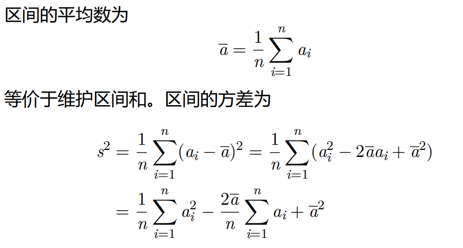
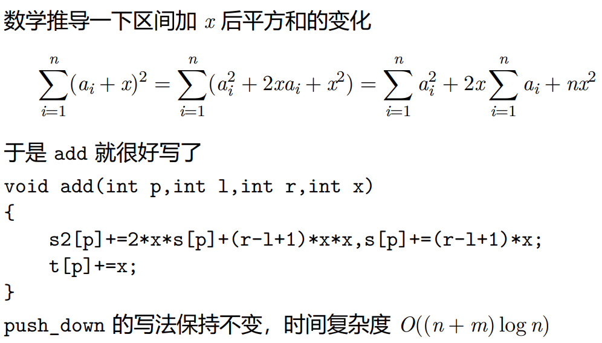

[P1471 方差](https://www.luogu.com.cn/problem/P1471)


> 线段树





```cpp
#include <bits/stdc++.h>
using namespace std;

const int N = 1e5 + 10;

int n, m;

int lc(int u) { return 2 * u; }

int rc(int u) { return 2 * u + 1; }

struct node {
    int l, r;
    double s, s2; // sum, sum ^ 2
    double lz; // 加法懒惰标记
} tr[4 * N];

double w[N];

void up(int u) {
    tr[u].s = tr[lc(u)].s + tr[rc(u)].s;
    tr[u].s2 = tr[lc(u)].s2 + tr[rc(u)].s2;
}

void add_u(int u, double k) {
    tr[u].s2 += 2 * tr[u].s * k + (tr[u].r - tr[u].l + 1) * k * k;
    tr[u].s += (tr[u].r - tr[u].l + 1) * k;
    tr[u].lz += k;
}

void down(int u) {
    if (tr[u].lz != 0) {
        add_u(lc(u), tr[u].lz);
        add_u(rc(u), tr[u].lz);
        tr[u].lz = 0;
    }
}

void build(int u, int l, int r) {
    tr[u] = {l, r, w[l], w[l] * w[l], 0};
    if (l == r) return;
    int mid = (l + r) / 2;
    build(lc(u), l, mid);
    build(rc(u), mid + 1, r);
    up(u);
}

double query_range_sum(int u, int l, int r) {
    if (tr[u].r < l || tr[u].l > r) return 0;
    if (l <= tr[u].l && tr[u].r <= r) return tr[u].s;
    down(u);
    return query_range_sum(lc(u), l, r) + query_range_sum(rc(u), l, r);
}

double query_range_sum2(int u, int l, int r) {
    if (tr[u].r < l || tr[u].l > r) return 0;
    if (l <= tr[u].l && tr[u].r <= r) return tr[u].s2;
    down(u);
    return query_range_sum2(lc(u), l, r) + query_range_sum2(rc(u), l, r);
}

double query_range_average(int u, int l, int r) {
    return query_range_sum(u, l, r) / (r - l + 1);
}

double query_range_variance(int u, int l, int r) {
    double s = query_range_sum(u, l, r);
    double s2 = query_range_sum2(u, l, r);
    int len = r - l + 1;
    return (s2 / len) - (s / len) * (s / len);
}

void add_range(int u, int l, int r, double k) {
    if (tr[u].r < l || tr[u].l > r) return;
    if (l <= tr[u].l && tr[u].r <= r) return add_u(u, k);
    down(u);
    add_range(lc(u), l, r, k), add_range(rc(u), l, r, k);
    up(u);
}

int main() {

    cin >> n >> m;
    for (int i = 1; i <= n; ++i) cin >> w[i];
    build(1, 1, n);
    int op, x, y;
    double k;
    cout << fixed;
    cout.precision(4);
    while (m--) {
        cin >> op;
        if (op == 1) {
            cin >> x >> y >> k;
            add_range(1, x, y, k);
        } else if (op == 2) {
            cin >> x >> y;
            cout << query_range_average(1, x, y) << "\n";
        } else if (op == 3) {
            cin >> x >> y;
            cout << query_range_variance(1, x, y) << "\n";
        }
    }


    return 0;
}
```

